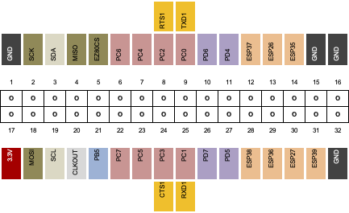

# What is GPIO

GPIO, or General Purpose Input and Output, is typically an electrical interface on a computer that is not dedicated to a single task. On the Agon this is exposed as a series of pins for the user to interface to. This might be for input controls, such as a joystick or buttons, motion sensors, or outputs to control your Christmas tree lights, send data to other displays, microprocessors, or even connect to the internet.

## GPIO Pinouts

Viewed from the back, component side up, with the connector to the right of the board.

