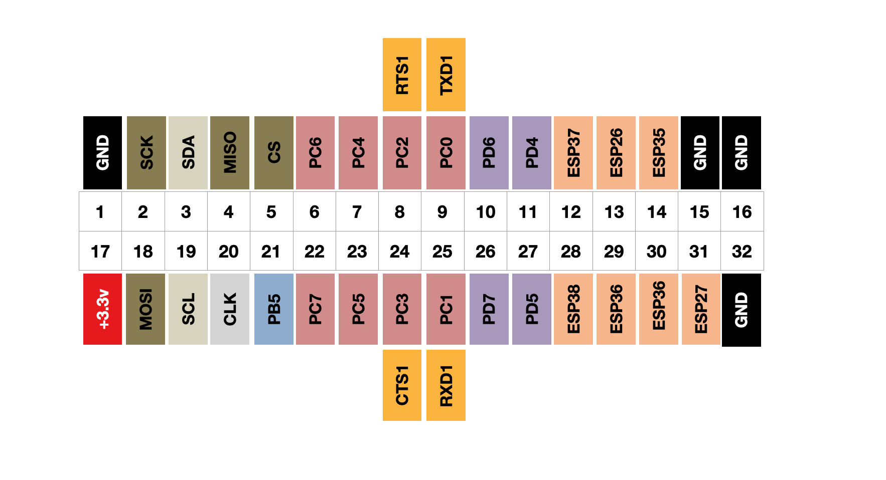
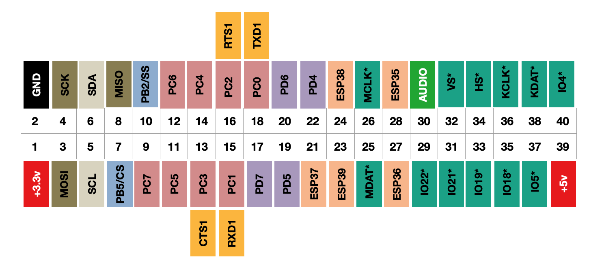

# User GPIO pins

GPIO, or General Purpose Input and Output, is an interface on a computer that is not dedicated to a single task. On the Agon this is exposed as a series of pins for the user to interface to. This might be for input controls, such as a joystick or buttons, motion sensors, or outputs to control your Christmas tree lights, send data to other displays, microprocessors, or even connect to the internet.

Whilst sharing many similar pins, there are some variations across the range of Agon machines.

The first generation Agon Light has a double row of 32 pins, whereas the Agon Light 2 has a double row of 34 pins. The additional pair of pins have been added for a battery power supply connection.

The Agon Console 8 adds a few extra rows for additional connectivity to other parts of the ESP processor.

## GPIO Pinouts - Original Agon Light by Bernardo Kastrup

Viewed from the back, component side up, with the connector to the right of the board.

## GPIO Pinouts - Agon Light Origins Edition by Bernardo Kastrup

Viewed from the back, component side up, with the connector to the right of the board. A slight change with an additional pair of pins to the right hand side. The pin numbering is the same as the Agon Light 2 by Olimex.

## GPIO Pinouts - Agon Light 2 manufactured by Olimex

The general layout is the same as the Origins Edition, apart from pins 1 & 2.

Olimex's proprietary UEXT connector is mounted next to the main IO bus. 

Note that although there are duplicate pins exposed on the UEXT conector as the main IO bus, they are connected to the same pins on the ez80 chip. They are there for convenience, but do not provide any additional hardware ports.

It is sometimes useful to have the duplicate pins for different purposes. For example, connecting a Nintendo Nunchuck controller on the UEXT using Olimex's adapter board, and a joystick on the main IO bus.

## GPIO Pinouts - Console 8 manufactured by Heber

Viewed from the top front, component side up.

The Console 8's pin numbering is different and although they look similar at first, some of the pins do not align with those of the Agon Light, so do not plug an Agon Light peripheral into the io bus of a Console 8.
Pins marked * go via a transputer.

