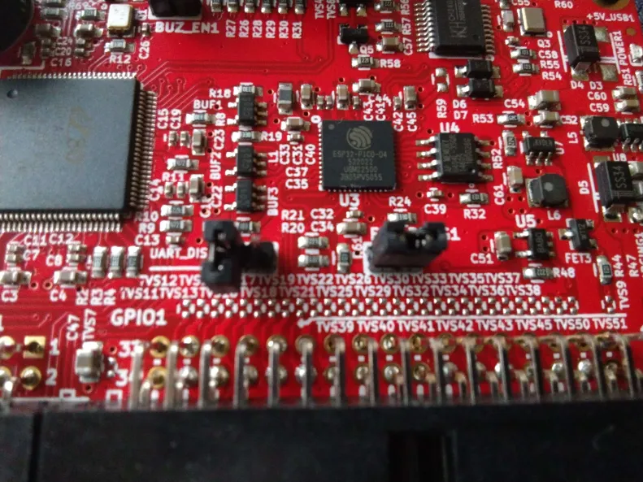

# Detailed firmware upgrade steps from 1.03 to Quark 1.04 or Console8 firmware

This guide lists all the required steps to upgrade an Agon, which has been delivered to you with older MOS/VDP version 1.03, to a later version.
Please follow each step as closely as possible and make sure that each item on the preparation list is completed before attempting the first upgrade steps.

## Preparation
0. Connect your Agon to a VGA monitor and PS/2 capable keyboard. You need to interact with it using the keyboard and monitor in the first update step
1. If you haven't done so already, prepare a micro SD card by formatting it with the FAT32 format and place the contents of a distribution [1](https://agonmite.gluonspace.com/) or [2](https://github.com/tomm/popup-mos) on it. If you already had a working SD card with stuff on it, just continue using it; then there is no need to format it or anything
2. Connect your Agon to a PC using a USB data cable. The type of USB cable may differ according to the Agon platform you're using: 
	- the Olimex AgonLight2 has a USB-C type connector
	- the Agon Console8 has a USB-B type connector
	- the Agon Origins edition has a USB-B type connector
	- the original AgonLight(1) has a USB-A type connector
3. Find out which serial/COM port shows up on your PC, after connecting your Agon using a USB cable and <em>note it down for later use</em>:
	- Under Windows, it shows up in the 'Device Manager', or you can type '[System.IO.Ports.SerialPort]::getportnames()' in a PowerShell terminal
	- Under Linux, you can find it by running 'dmesg | grep tty' in a shell
	- Under MacOS, you can find it by running 'ls /dev/tty.*' in Terminal
4. For the Olimex AgonLight2 - please make sure the jumpers on the board are placed like this: the **LEFT** jumper is unconnected/open/placed on just one pin, the **RIGHT** jumper is connected/closed/placed on both pins

	

5. If it doesn't exist yet, create a folder named 'mos' on the SD card 
6. Download the file [flash.bin](https://github.com/envenomator/agon-flash/releases/download/v1.6/flash.bin) and place it <em>IN THE 'mos' FOLDER</em> of your SD card
7. Download one of the following options and place 'MOS.bin' in <em>IN THE ROOT</em> of your SD card:
	- If you'd like to upgrade to the latest and greatest Console8 release, please download [MOS.bin](https://github.com/AgonConsole8/agon-mos/releases/latest/download/MOS.bin)
	- If you'd like to upgrade to the latest official Quark 1.04 release, please download [MOS.bin](https://github.com/breakintoprogram/agon-mos/releases/download/v1.04/MOS.bin)
8. Eject the SD card from your PC, insert it into your Agon
9. RESET your Agon
10. Download [agon binaries](https://github.com/envenomator/agon-binaries/archive/refs/heads/master.zip) to your PC and unzip it. I'll refer the unzipped folder later as 'agon-binaries-master'
11. If you are using Linux/MacOS, please install python and install the python esptool.py using [this](https://docs.espressif.com/projects/esptool/en/latest/esp32/) guide from espressif

## Upgrade the Agon MOS
0. Complete all the steps from the preparation requirements
1. Make sure to reset your Agon, so it shows the Agon's VDP/MOS versions
2. Make sure to exit BBC Basic, if that autostarted, by typing '*BYE' and ENTER. If your prompt is a '\*', you are on a MOS prompt already
3. Type 'flash mos' and ENTER
4. If the flash tool starts, calculates the CRC from the MOS.bin file and asks you to 'Flash firmware (y/n)', press 'y'. If it doesn't ask, check your preparations and make sure the flash.bin is installed under /mos and MOS.bin is in the root of the SD card
5. Agon MOS upgrade is done - continue to upgrade the Agon VDP

## Upgrade the Agon VDP
0. Complete all the steps from the preparation requirements
1. Upgrade the Agon MOS first
2. On windows start a PowerShell terminal, on Linux start a shell and on MacOS start Terminal
3. Change folder to the folder 'agon-binaries-master', where you unzipped the downloaded binaries earlier, using the 'cd' command
4. Change to the subfolder of the VDP release you'd like to upgrade to:
	- For a very recent Console8 release: On Windows, change to the subfolder '.\VDP\Console8 2.6.0\'
	On Linux/MacOS, change to the subfolder ./VDP/Console8\ 2.6.0/
	- For the official Quark 1.04 release: On Windows, change to the subfolder '.\VDP\Quark 1.04\'
	On Linux/MacOS, change to the subfolder ./VDP/Quark\ 1.04/

5. Start the upgrade script with the serial/COM port you noted earlier - COMXX and /dev/ttyUSBXXX are examples here:
	- On Windows type - '.\flash.bat COMXX'
	- On Linux/MacOS, run these commands in sequence:
		- sed -i -e 's/\r$//' flash.sh
		- chmod +x flash.sh
		- ./flash.sh /dev/ttyUSBXXX
6. When the esptool is done uploading and it says 'Hard resetting via RTS pin', please press the physical reset button on your Agon

Done