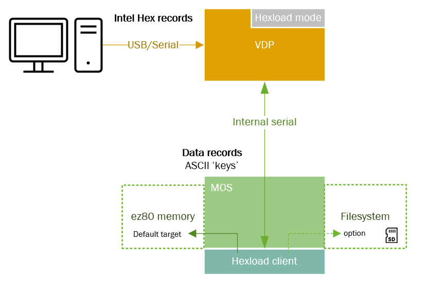

# An Overview of VDU Commands

The Agon VDP system aims to be as compatible as practical with the Acorn BBC Micro's VDU command system.  It also supports some extensions as added by later Acorn computer systems, and the various versions of BBC BASIC by R.T.Russell.  Where necessary, some extensions have been added to help facilitate the Agon's unique features and architecture.

This documentation provides a more in-depth explanation to each top-level VDU control code, and provides links to further documentation for more detailed individual commands.

Please note that not all versions of the VDP support the complete command set.  The first version of the VDP to support the complete top-level list of VDU commands is the Agon Console8 VDP 2.5.0.  The following list uses the following symbols to indicate which VDP versions support which commands:

 \* Requires VDP 1.03 or above<br>
 \** Requires VDP 1.04 or above<br>
 § Requires Console8 VDP 2.3.0 or above<br>
 §§ Requires Console8 VDP 2.5.0 or above<br>
 §§§ Requires Console8 VDP 2.7.0 or above<br>
 §§§§ Requires Console8 VDP 2.8.0 or above<br>

In general, bytes/characters in the range of 0-31 are treated as control or command codes by the VDP.  Depending on the command, the VDP will then interpret bytes that follow as parameters to the command, continuing until sufficient bytes have been read to satisfy the command.  If there are insufficient bytes to satisfy the command, then the VDP will wait until more bytes are available, and timeout after 200ms.  If too many bytes are sent for a command, then the VDP will interpret those new bytes as another command.

Any VDU command that is the VDP does not recognise (such as `VDU 2` when running on Quark 1.04) will be ignored.  Please note that when VDP comes across a command it does not understand it will proceed to interpret the next byte it receives as the next command.  This means that code written for a later version of the VDP may not work correctly on earlier versions and produce unexpected results.  Care should be taken to ensure that code is compatible with the VDP version it is running on, and it is generally advised to try to detect features before using them.

All other characters, i.e. those in the range of 32 to 126 and 128 to 255, are sent to the screen as ASCII, unaltered.

## `VDU 0`: Null (no operation)

On encountering a `VDU 0` command, the VDP will do nothing.  This may be useful for padding out a VDU command sequence, or for inserting a placeholder for a command that will be added later.

## `VDU 1`: Send next character to "printer" (if "printer" is enabled) §§

Ensures that the next character received by the VDP is sent through to the "printer", and not to the screen.  This is useful for sending control codes to the "printer", or for sending data to the "printer" that is not intended to be displayed on the screen.  It allows characters that would not otherwise normally be sent through to the "printer" to be sent.

If the "printer" has not been enabled then this command will just discard the next byte sent to the VDP.

## `VDU 2`: Enable "printer" §§

Enables the "printer".

In the context of the Agon platform, the "printer" is a serial terminal that is connected to the VDP's USB port.  Typically this port is used for power, but it can also be used to send and receive data to and from the VDP.

When the "printer" is enabled, the VDP will send characters it receives to the "printer" as well as to the screen.  It will additionally send through control codes 8-13.  To send other control codes to the "printer", use the `VDU 1` command.

The VDP will not send through other control codes to the printer, and will will not send through data it receives as part of other commands.

## `VDU 3`: Disable "printer" §§

Disables the "printer".

## `VDU 4`: Write text at text cursor

This causes text to be written at th current text cursor position.  This is the default mode for text display.

Text is written using the current text foreground and background colours.

## `VDU 5`: Write text at graphics cursor

This causes text to be written at the current graphics cursor position.

Using this, characters may be positioned at any graphics coordinate within the graphics viewport.  This is useful for positioning text over graphics, or for positioning text at a specific location on the screen.

Characters are plotted using the current graphics foreground colour, using the current graphics foreground plotting mode (see `VDU 18`).

The character background is transparent, and will not overwrite any graphics that are already present at the character's location.  The exception to this is `VDU 27`, the "delete" character, which backspaces and deletes as per its usual behaviour, but will erase using the current graphics background colour.

## `VDU 6`: Enable screen (opposite of `VDU 21`) §§

This enables the screen, and re-enables VDU command processing, reversing the effect of `VDU 21`.

## `VDU 7`: Make a short beep (BEL)

Plays a short beep sound on audio channel 0.  If the audio channel is already in use, or has been disabled, then this command will have no effect.

## `VDU 8`: Move cursor back one character

Moves the text cursor one character in the negative "X" direction.  By default, when at the start of a line it will move to the end of the previous line (as defined by the current text viewport).  If the cursor is also at the top of the screen then the viewport will scroll down.  The cursor remains constrained to the current text viewport.

When in `VDU 5` mode and the graphics cursor is active, the viewport will not scroll.  The cursor is just moved left by one character width.

Further behaviour of the cursor can be controlled using the `VDU 23,16` command.

It should be noted that as of Console8 VDP 2.5.0, the cursor system does not support adjusting the direction of the cursor's X axis, so this command will move the cursor to the left.  This is likely to change in the future.

## `VDU 9`: Move cursor forward one character

Moves the text cursor one character in the positive "X" direction.  By default, when at the end of a line it will move to the start of the next line (as defined by the current text viewport).  If the cursor is also at the bottom of the screen then the viewport will scroll up.

Essentially this is the opposite of `VDU 8`.

When in `VDU 5` mode and the graphics cursor is active, the viewport will not scroll.

## `VDU 10`: Move cursor down one line

Moves the text cursor one line in the positive "Y" direction.  By default, when at the bottom of the screen the viewport will scroll upwards.

When in `VDU 5` mode and the graphics cursor is active, the viewport will not scroll, and the cursor is just moved down by one character height.

## `VDU 11`: Move cursor up one line

Moves the text cursor one line in the negative "Y" direction.  By default, when at the top of the screen the viewport will scroll downwards.

Essentially this is the opposite of `VDU 10`.

When in `VDU 5` mode and the graphics cursor is active, the viewport will not scroll.

## `VDU 12`: Clear text area (`CLS`)

Clears the current text viewport to the current text background colour, and moves the text cursor to the "home" position of the viewport (usually the top left).

This is identical to the BASIC `CLS` keyword.

## `VDU 13`: Carriage return

Moves the text cursor to the start (or column 0) of the current line.

## `VDU 14`: Page mode On *

When page mode is on, scrolling will stop after each page.  Output will be paused until "Shift" has been pressed on the keyboard.

## `VDU 15`: Page mode Off *

Disables page mode.  This is the default mode.

## `VDU 16`: Clear graphics area (`CLG`)

Clears the current graphics viewport to the current graphics background colour.

The current graphics cursor is unaffected.

This is identical to the BASIC `CLG` keyword.

## `VDU 17, colour`: Set text colour (`COLOUR`)

This will set the current text colour to the given colour, as defined by the colour palette.

Colour numbers in the range 0-127 are interpreted as foreground colours, and numbers in the range 128-255 are interpreted as background colours.

The actual range of colours supported will depend on the screen mode you are using.  Agon systems can only actually display a maximum of 64 colours (numbered 0 to 63).  The VDP will loop around the colour palette if a colour number is given that is outside the range of colours supported by the screen mode.  This means that for instance colour 65 is always equivalent to colour 1, or when in a 16 colour screen mode selecting colour 32 would be equivalent to choosing colour 0.

This command is identical to the BASIC `COLOUR` keyword.

## `VDU 18, mode, colour`: Set graphics colour (`GCOL mode, colour`)

This command will set both the current graphics colour, and the current graphics painting mode.

As with `VDU 17` the colour number will set the foreground colour if it is in the range 0-127, or the background colour if it is in the range 128-255, and will be interpreted in the same manner.

Up to and including Console8 VDP 2.5.0 support for the `mode` parameter was highly limited.  The only fully supported mode was mode 0, which is the default mode.  This mode sets on-screen pixels with the target colour.  From VDP 1.04 onwards there was very limited support for mode 4, which would invert on-screen pixels, but was only supported for straight line plotting operations.

As of Console8 VDP 2.6.0, all 8 of the basic modes are supported for all currently supported plot operations.  Separate plot modes are tracked for foreground and background colours.

The full array of available modes is as follows:

| Mode | Effect |
| ---- | ------ |
| 0 | Set on-screen pixel to target colour value |
| 1 | OR value with the on-screen pixel |
| 2 | AND value with the on-screen pixel |
| 3 | EOR value with the on-screen pixel |
| 4 | Invert the on-screen pixel |
| 5 | No operation |
| 6 | AND the inverse of the specified colour with the on-screen pixel |
| 7 | OR the inverse of the specified colour with the on-screen pixel |

For more information on the various plot commands, please see the [VDP PLOT command documentation](PLOT-Commands.md)

(Acorn's graphics system supported some further GCOL mode options, which could specify the use of a fill pattern, which is not currently supported by the Agon VDP.  Support for these modes may be added in a future version of the VDP firmware.)

This command is identical to the BASIC `GCOL` keyword.

## `VDU 19, l, p, r, g, b`: Define logical colour

This command sets the colour palette, by mapping a logical colour (i.e. the colour as selected via `VDU 17, colour` or `VDU 18, mode, colour`) to a physical colour.  This is useful for defining custom colours, or for redefining the default colours.

If the physical colour number is given as 255 then the colour will be defined using the red, green, and blue values given.

If the physical colour value is less than 64, the value is interpreted as a 6-bit colour number where the number in binary form is in the format `RRGGBB`.

Any other physical colour value (i.e. 64 to 254) is not valid and the command will be ignored.

If the physical colour is not 255 then the red, green, and blue values must still be provided, but will be ignored.

The values for red, green and blue must be given in the range 0-255.  You should note that the physical Agon hardware only supports 64 colours, so the actual colour displayed may not be exactly the same as the colour requested.  The nearest colour will be chosen.

Up to and including Console8 VDP 2.5.0 this command would have no effect when in a 64 colour screen mode, and the palette in those modes was fixed.

From Console8 VDP 2.6.0 onwards, the command will now work in all screen modes, and will allow for the definition of custom colours.  Please note that when in a 64 colour screen mode there is no "palette" for the screen display per-se, so the command will not have any effect to the existing screen display.  It will only affect the colours used for subsequent graphics or text operations.

This command is equivalent to the two ways the BASIC `COLOUR` keyword can be used to redefine the colour palette: `COLOUR l, p` or `COLOUR l, r, g, b`.

## `VDU 20`: Reset palette and text/graphics colours and drawing modes §§

This command will reset the colour palette to the default palette, and will reset the text and graphics colours and drawing modes to their default values.

## `VDU 21`: Disable screen §§

This command will "disable the screen", stopping any further VDU commands from being processed.  This is useful for temporarily disabling the screen, for instance when using the "printer" to send data to a serial terminal.  The actual screen display will not be turned off, but the VDP will stop processing VDU commands so changes to the display will not be made until the screen is re-enabled.

The exception to this is commands `VDU 1` and `VDU 6`, which will still be processed.  If the "printer" has been enabled, bytes sent to the VDP still be sent through to the "printer", with the restrictions as described against `VDU 2`.

Please note that the behaviour of the Agon system differs from Acorn systems when `VDU 21` has been called.  On an Agon system, when the screen has been disabled the VDP will consider each and every byte received as a new command, looking out specifically for a `VDU 6` command byte to re-enable the command interpreter.  It will not attempt to interpret any bytes received as a parameter to the previous command.  An Acorn system, on the other hand, would accept parameters for VDU commands, and just not process the command.  This means that code written for an Acorn system may not work correctly on an Agon system if it uses `VDU 21`.

## `VDU 22, n`: Select screen mode (`MODE n`)

Changes the screen mode to the given mode number.

Please see the [Screen Modes](Screen-Modes.md) documentation for more information on the screen modes supported by the Agon VDP.

This command is identical to the BASIC `MODE` keyword.

Changing the screen mode will reset the graphics system, returning most settings to their defaults.  The current cursor behaviour (as defined using `VDU 23, 16, x, y`) will be retained.

## `VDU 23, n`: Re-program display character / System Commands

This command serves two purposes.

Firstly when `n` is in the range of 32-255 it will re-program the character in the system font at the given character code.  This is useful for redefining the character set, or for adding custom characters to the system character set.  The format of the command in this mode is:
```
VDU 23, char_no, r1, r2, r3, r4, r5, r6, r7, r8
```
Where `char_no` is the character number to re-program, and `r1` to `r8` are the 8 bytes of data that define the character in rows from top to bottom.  Each byte defines one row of the character, with the least significant bit of each byte defining the left-most pixel of the row, and the most significant bit defining the right-most pixel of the row.

Please note that as of Console8 VDP 2.8.0 this form of the command will only work if the system font is the currently selected font.  For more information please see the [Font API](Font-API.md) documentation.

Note: There is a related VDU 23 System Command which can [program the entire character range 0-255](System-Commands.md#vdu-23-0-90-n-b1-b2-b3-b4-b5-b6-b7-b8-redefine-character-n-0-255-with-8-bytes-of-data-), and a reset command is also available to [reset the system font](System-Commands.md#vdu-23-0-91-reset-all-characters-to-original-definition-) back to default.

The second purpose of this command is to send system commands to the VDP.

The following commands are supported:

### `VDU 23, 0, <command>, [<arguments>]`: System commands

Commands starting with `VDU 23, 0` are system commands.  These commands are used to configure the VDP and to control its behaviour.  This includes functionality such as the [audio system](Enhanced-Audio-API.md), the [buffered commands API](Buffered-Commands-API.md), [font API](Font-API.md), and [context management API](Context-Management-API.md).  For more information see the [System Commands](System-Commands.md) documentation.

### `VDU 23, 1, n`: Cursor control 

This command controls the appearance of the text cursor.

| Value | Meaning |
| ----- | ------- |
| 0 | Hide the cursor |
| 1 | Show the cursor |
| 2 | Make the cursor steady §§§§ |
| 3 | Make the cursor flash §§§§ |

Please note that in VDU 5 mode the cursor will not be visible, and the cursor control commands will have no effect.

Previous versions of this documentation indicated that values 2 and 3 were supported as of Console8 VDP version 2.7.0.  Unfortunately this was incorrect as a bug prevented these values from working correctly.  (This functionality could however be used via `VDU 23, 0, &0A` on that version of the VDP.)  As of Console8 VDP 2.8.0 these values are now supported.

### `VDU 23, 6, n1, n2, n3, n4, n5, n6, n7, n8`: Set dotted line pattern §§§

This command sets the dotted line pattern for the various dotted line (`VDU 25`) PLOT commands.  The pattern is defined by 8 bytes, where each bit in each byte defines a pixel in the pattern.  Bits are used from the pattern most significant bit first, from bytes `n1`-`n8`, so the top-most bits (most significant bits) of the first byte (`n1`) define the start of the pattern.

The repeat length of the pattern is set using `VDU 23, 0, 242, n`, where `n` is the number of pixels to repeat the pattern for.  The default repeat length is 8, meaning that only the `n1` byte will be used for the pattern.  Setting the repeat length to zero will reset to the default pattern, with the default repeat length.

The current dotted line pattern will be reset on changing screen mode.

Support for this command was added in Agon Console8 VDP 2.7.0.

### `VDU 23, 7, extent, direction, movement`: Scroll

This command scrolls in a given direction.

The `extent` parameter controls what part of the screen will be scrolled.  A value of `0` means the current text viewport, a `1` means the whole screen, a `2` means the current graphics viewport, and `3` is interpreted as the current "active" viewport (as chosen using `VDU 4` or `VDU 5`).

The `direction`` parameter can be one of the following values:

| Value | Meaning |
| ----- | ------- |
| 0 | Scroll right |
| 1 | Scroll left |
| 2 | Scroll down |
| 3 | Scroll up |
| 4 | Scroll in positive X direction * |
| 5 | Scroll in negative X direction * |
| 6 | Scroll in positive Y direction * |
| 7 | Scroll in negative Y direction * |

\* Support for these values was added in Agon Console8 VDP 2.5.0 for cursor behaviour values set by `VDU 23, 16, x, y`, but only for bits 1 and 2.  As of Console8 VDP 2.7.0, bit 3 of the cursor behaviour is also supported allowing the x and y directions to be swapped, thus letting X be vertical and Y be horizontal.

The `movement` parameter controls the movement amount.  A value of `0` means that the screen will be scrolled by one character width/height in the given direction.  Any other value is interpreted as the number of pixels to scroll in the given direction.

Support for a `movement` value of zero was added in Agon Console8 VDP 2.5.0.  Before this version a `movement` value of zero would be interpreted as no movement.

The Agon implementation of this command differs from Acorn systems in the interpretation of the `movement` and `extent` parameter.  On Acorn systems, the only valid `extent` values are 0 or 1.  Acorn's `movement` parameter can also only be 0 or 1, but vertical movement would always be one character height, and horizontal movement one character width for a movement value of 0, and one byte for a movement value of 1, which made the results of this command vary depending on the current screen mode.  The Agon implementation of this command allows for more flexibility, and allows for scrolling by a given number of pixels in any direction, at the cost of some compatibility.


### `VDU 23, 16, setting, mask`: Define cursor movement behaviour

This command controls the behaviour of the text cursor.  It is used to adjust the cursor behaviour via a bitmask.  The new setting is calculated as:
```
new_setting = (current_setting AND mask) EOR setting
```

This method of setting the cursor behaviour allows you to set individual bits, or to clear individual bits, without needing to know the current setting.

The interpretation of the settings byte flags is as follows:

| Bit | Value | Meaning |
| --- | ----- | ------- |
| 7 | 0 | Normal value |
| 7 | 1 | Undefined |
| 6 | 0 | Graphics cursor (VDU 5 mode) does an implicit cr/lf when it moves off right of graphics viewport |
| 6 | 1 | Graphics cursor carries on off edge of graphics viewport |
| 5 | 0 | Cursor moves right after a character is printed |
| 5 | 1 | Cursor does not move right after a character is printed § |
| 4 | 0 | Text cursor (VDU 4 mode) will scroll when it moves off the bottom of the screen |
| 4 | 1 | Text cursor will wrap to top of screen when it moves off the bottom of the screen § |
| 3, 2, 1 |  | Defines the cursor direction, as follows * |
| 3, 2, 1 | 0 0 0 | X direction is right, Y direction is down * |
| 3, 2, 1 | 0 0 1 | X direction is left, Y direction is down * |
| 3, 2, 1 | 0 1 0 | X direction is right, Y direction is up * |
| 3, 2, 1 | 0 1 1 | X direction is left, Y direction is up * |
| 3, 2, 1 | 1 0 0 | X direction is down, Y direction is right * |
| 3, 2, 1 | 1 0 1 | X direction is down, Y direction is left * |
| 3, 2, 1 | 1 1 0 | X direction is up, Y direction is right * |
| 3, 2, 1 | 1 1 1 | X direction is up, Y direction is left * |
| 0 | 0 | Disable scroll protection |
| 0 | 1 | Enable scroll protection § |

The default value for each setting is zero, i.e. all bits are cleared.

\* Full support for these settings was added in Agon Console8 VDP 2.7.0.  Partial support for bits 1 and 2 was added in Console8 VDP 2.5.0 but only for direction-based scrolling (`VDU 23, 7`).

§ Whilst the Quark documentation claims that bits 4 and 5 is supported in the Quark 1.04 release, they were not actually supported in the VDP firmware.  The cursor would always move right after a character was printed, and the text cursor could never wrap to the top of the screen.  The cursor direction bits were also not supported.  Support for scroll protection was also limited to an incorrect (buggy) implementation, which would simply prevent vertical scrolling.  Full support for all of these features was added in Agon Console8 VDP 2.7.0.

Scroll protection, when enabled, means that when in `VDU 4` mode printing a character that results in the cursor moving off the right-hand edge of the screen will cause a "pending newline" to be generated, rather than immediately performing a newline.  When this occurs, the cursor position will be one position greater than the right-most accessible column.  This newline will be executed just before the next character is printed if the cursor has not otherwise been moved back within the screen.  This means that sending a backspace character (`VDU 127`) or cursor left command (`VDU 8`) would cancel the pending newline, whilst a cursor right command will execute it.

Enabling scroll protection therefore allows you to print a character to the bottom right-most character position on the screen without causing the screen to scroll.

### `VDU 23, 23, n`: Set line thickness §§§

This command sets the line thickness for the various line drawing commands.  The line thickness is set to `n` pixels.  The default line thickness is 1 pixel.

This command was added to Agon Console8 VDP 2.6.0.  Prior to that version, the line thickness was always 1 pixel.  PLOT commands that draw filled shapes are not affected by the line thickness.  Line plot commands that omit the first or last point may produce unexpected results when the line thickness is greater than 1.


### `VDU 23, 27, <command>, [<arguments>]`: Bitmap and sprite commands

See the [Bitmap and Sprite Commands](Bitmaps-API.md) documentation for more information.

### `VDU 23, 28`: Hexload
This command switches the VDP to a dedicated Intel Hex receiver/decoder. After sending this command, the VDP temporarily blocks all other functions and expects Intel Hex-formatted data on it's USB/serial port. The baudrate and serial configuration settings are displayed on-screen, and the VDP loops through all incoming records until the final End-of-File record is received.
Starting console8-vdp 2.8.2+, the user can press the 'escape' key to abort an incoming transfer and return the VDP to it's regular function.

Detailed documentation for the Intel Hex format can be found [here](https://en.wikipedia.org/wiki/Intel_HEX)

The purpose of hexload is to enable a user to send binaries directly to ez80 memory, using a text-formatted binary (Intel Hex) from an external PC to the external USB/serial port of an Agon system. The solution has a few components that need to work together in order to make this happen:



A specific client that sends the VDU sequence to the VDP, to start the 'remote' Intel Hex receiver/decoder, is the component that is responsible for receiving preformatted data-records from the VDP. Data is sent to the client using VDP virtual keystroke packets, where packets contains an ASCII keycode for each received byte.
The format of this data and the sequence of events of the protocol to the client is detailed below.
The current hexload [utility](https://github.com/envenomator/agon-hexload) streams the incoming data directly to memory and optionally to the filesystem. The memory destination address(es) are dependent on which address records are present in the Intel Hex file sent to the VDP. If no address records are present (for example when a binary is converted to Intel Hex format before sending) the VDP defaults to the Agon 0x40000 load address.

The MOS has no specific role, other than to accept virtual keyboard packets and send out bytes to the VDP.

In order to reliably transfer the incoming Intel Hex stream at full serial speeds, the VDP runs a dedicated Intel Hex receiver and decodes all Intel Hex records to data packets that are sent to the MOS as virtual keystrokes. This allows the VDP to perform the bulk of Intel Hex processing, while the lower-powered ez80 can focus on data reception.

The RTS/CTS flowcontrol lines on the USB/serial interface are hardwired for ESP32 boot selection, per Espressif standards. Any flowcontrol on the USB/serial interface is therefore not possible on this serial interface, which leads to potential periodic loss of incoming packets. While the Intel Hex format specifies a checksum at the end of each record, this will only detect single-bit errors and not multi-bit issues that easily arise when the USB/serial is overrun. In order to deal with this, the VDP starting 2.8.2+ allows for an extended, Agon-proprietary Intel Hex format where CRC16 verification takes place at each record between PC and VDP, and the VDP sends back it's calculated CRC16. The PC sender can detect if the VDP has received incorrect data, whereupon it retransmits a record if necessary. At the start of an extended format session, the PC sends a custom Intel Hex record that contains the full CRC32 checksum of all data to be sent to the VDP. The VDP then verifies and displays the results upon End-of-File record reception.

The RTS/CTS flowcontrol lines between VDP and ez80 are only in use one-way to the VDP, not from the VDP to the ez80. This creates a similar challenge in absence of flowcontrol. The data format sent to the hexload utility periodically waits for acknowledgement and asks for a mirror of each record's checksum to be sent back to the VDP. Starting 2.8.2+, using extended format, the VDP will retransmit corrupted data to the ez80, because it has a way to temporarily pause the incoming traffic from the PC.

#### Internal data records
At each Intel Hex DATA record, the VDP sends these bytes as virtual keystrokes to MOS:
1. Start/stop byte - 0x01 indicates a data packet follows, 0x00 indicates end of transfer / return to normal VDP function
2. Three bytes of the 24-bit address of the following packet, in big-endian format (U / H / L)
3. A single byte containing the number of data bytes to be sent in this packet
4. 0-n data bytes as indicated previously

The hexload utility should then transmit a single byte to the VDP, containing a 2s complement to the sum of all received bytes. This byte is added to the running checksum by the VDP, to detect and indicate communication errors to the Hexload utility.
Address information from Intel Hex ADDRESS records, are parsed by the VDP and sent to the hexload utility as part of data packets with an address header.

#### Extended Intel Hex format
A Agon-proprietary extended format has been devised, to allow CRC16 checks at each Intel hex record's line, retransmission upon failed verification and full CRC32 verification at end of transmission. The VDP switches to reception of the extended format, upon receipt of a specific IntelHex-formatted start record:

    :06 0000 FF XXXXXXXX CC

1. : start of record
2. 6 bytes of payload data, indicated by a single byte (2 ASCII nibbles '06')
3. 0x0000 start address (4 ASCII nibbles '0000' ignored / unused)
4. Non-standard record type 0xFF (2 ASCII nibbles 'FF')
5. The CRC32 of the entire payload to be sent, in Intel Hex format (6 ASCII nibbles)
6. A regular Intel Hex checksum of a single byte (2 ASCII nibbles)
This command is used by the hexload utility, and should not be used by user applications.

After switching to the extended format, the VDP expects all subsequent Intel Hex records to have a CRC16 appended to it, containing the CRC16 of the original Intel Hex record, including the ':' character. In this way, all content can be verified. The CRC16 is sent using Intel Hex format, using 4 ASCII nibbles.
The VDP then sends back it's own calculated CRC16 in binary form (2 bytes), so it allows the PC sender application to retransmit records if necessary.

After the PC sender sends the last (End-of-file) Intel Hex record, the VDP sends back it's calculated CRC32 in binary form (4 bytes), and issues a result statement before it exits the receiver/decoder role.

## `VDU 24, left; bottom; right; top;`: Set graphics viewport **

This command sets the graphics viewport.  The graphics viewport defines the area of the screen that graphics will be drawn to.  It is also the area that will be cleared by the `VDU 16` command.

It should be noted that the coordinates given for this command must lie within the screen area.  If the coordinates are outside of the screen area then the command will be ignored.  When using OS Coordinates (the default coordinate system) this means that the coordinates must be in the range 0-1279 for the x-axis positions, and 0-1023 for the y-axis positions.

Coordinates given are "inclusive", meaning that drawing locations up to and including those given will be drawn to.  To set a graphics viewport that is a single pixel tall, therefore, the `bottom` and `top` coordinates should be the same.

(Please note that owing to a bug in the VDP firmware, viewports of a single pixel wide or tall were not supported until Console8 VDP 2.7.0.  Prior to that version a command to set a single pixel high viewport would be ignored.)

## `VDU 25, mode, x; y;`: [PLOT command](PLOT-Commands.md)

This command is used for graphics plotting, and is equivalent to the BASIC `PLOT` command.

The aim for this command is to support all of Acorn's original `PLOT` modes, however currently only a limited number of plotting modes are supported.  Support for plot modes has expanded over time, and will continue to expand in the future.

For more information see the [PLOT Commands](PLOT-Commands.md) documentation.

## `VDU 26`: Reset graphics and text viewports **

This command resets the graphics and text viewports to their default values, homes the text cursor, and resets the graphics origin.  The default graphics viewport is the whole screen, and the default text viewport is the whole screen.

NB prior to Console8 VDP 2.8.0, this command had a bug and did not reset the graphics origin.

## `VDU 27, char`: Output character to screen §

Sends the next character to the screen.  This allows for characters outside of the normal ASCII range of 32-126 and 128-255 to be drawn on the screen.

## `VDU 28, left, bottom, right, top`: Set text viewport **

This defines a text viewport.  The text viewport defines the area of the screen that text will be drawn to.  It is also the area that will be cleared by the `VDU 12` command.

The coordinates given are character positions, based on the currently selected font, not pixel positions.

## `VDU 29, x; y;`: Set graphics origin

This command sets the graphics origin.  This sets where on the screen graphics coordinates are relative to for drawing commands.

## `VDU 30`: Home cursor

When in `VDU 4` mode, this moves the text cursor to the home (top left) position of the current text viewport.  When in `VDU 5`` mode, this moves the graphics cursor to the home position of the current graphics viewport.

## `VDU 31, x, y`: Move text cursor to x, y text position

Moves the text cursor to the given text position.  The coordinates given are character positions based on the currently selected font, not pixel positions.

This is equivalent to the BASIC `TAB(x, y)` statement.

Please note that if you have changed the text viewport, the coordinates given will be relative to the text viewport, not the whole screen.

The position of the text cursor is not constrained to the text viewport, so it is possible to move the cursor outside of the viewport.  A tab command attempting to move the cursor outside of the text viewport will be ignored.

## `VDU 127`: Backspace

Moves the text cursor back one character, and deletes the character at that position.


